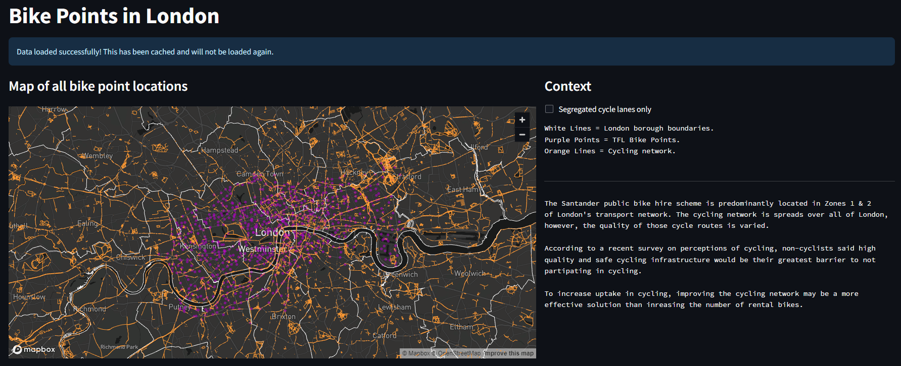

# JDAC-Technical-Exercise
A demonstration of a tool to support decision makers on public health policy.

## Purpose
This repository conatins the code for an MVP of a dashboard, aimed at supporting a decision maker to understand how to best increase uptake of cycling in London. The dashboard brings together several relevant datasets, and surrounds them with important context.

The dashboard should look like this when produced:

## Setup
The code is designed to run with minimal setup. One simply needs to:
* Clone the repository to your local device
* Download a recent version of python such as [python v3.12.2](https://www.python.org/downloads/)
* Setup a virtual environment: 

`python3 -m venv your_local_python_environment`

* Activate that environment: 

`source your_local_python_environment/bin/activate`

* Recreate the development environment with: 

`pip install -r requirements.txt`

* The final step is run the streamlit app:

`streamlit run code/streamlit_app.py`

## Description
This repository brings together 3 datasets:
* The locations of TFL rental Bike Point pickups
* Boundaries for the London Boroughs using ONS Local Authority Districts
* The cycling road network as defined by TFL

The TFL bike point locations closely follow the boundaries of Zone 1 and Zone 2 London transport regions. Increasing accessibility of the bikes to locations in Zone 3 and beyond, would undoubtly increase uptake of cycling in those zones.

The cycling network on the surface looks very comprehensive, however, when distinguishing between cycling routes that shares roadspace with other vehicles and those that are segregated, the network becomes far more fragmented. According to a [recent survey](https://www.gov.uk/government/statistics/national-travel-attitudes-study-wave-5/national-travel-attitudes-study-wave-5#cycling) on perceptions of cycling; unsafe and non-segregated cycling routes were seen as a major inhibiter for non-cyclists taking up the activity. Perhaps a greater impact on the uptake of cycling could be had through providing higher quality cycling network infrastructure.

## Next Steps

A comprehensive assessment of the TFL bike rental scheme would look at demand of existing bike points, which can be  extracted from CycleCounters on [data.tfl](https://cycling.data.tfl.gov.uk/).

However, I think this tool could be effective for visualising cycling networks and showing which are the most in-demand routes. A possible policy could be to identify the population hubs in Zone 3/4/5, and develop cycling infrastructure from those locations to popular work and retail areas.
